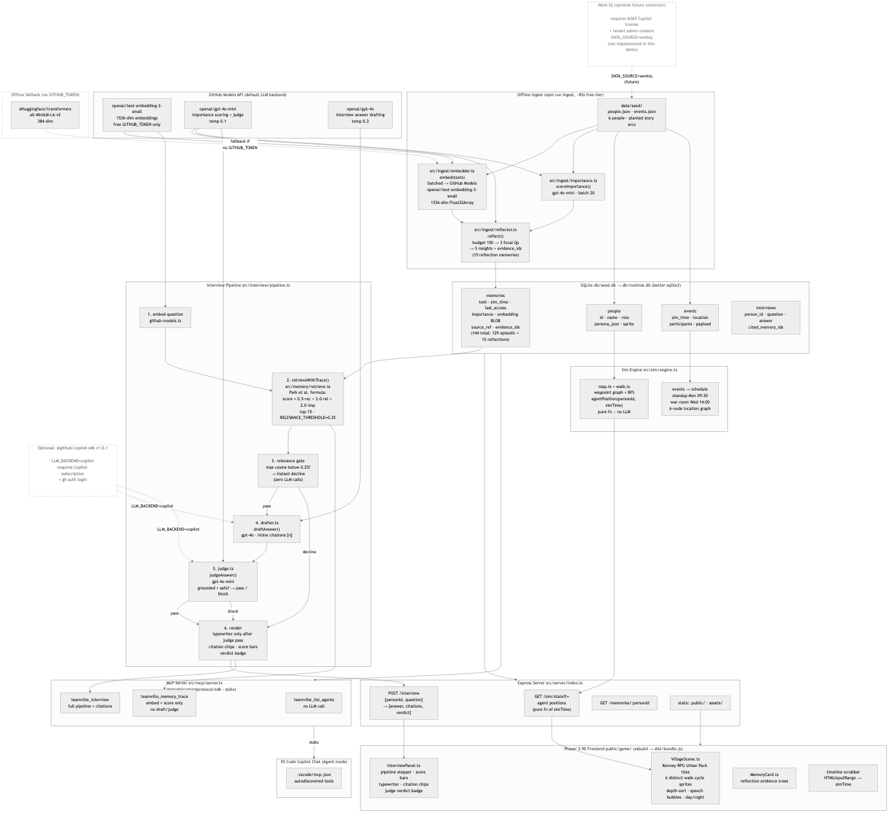

# Teamville

> Google Street View for your team's week, where every colleague is interviewable.

Built for the **Microsoft Agents League Hackathon, AI Skills Fest iteration 2, Creative Apps track** (June 2026).

[](docs/architecture.mmd)

---

## What it is

Teamville is a **deterministic replay engine** for a real work week, combined with a **live interview system** where you can question any colleague in character.

The village clock runs the actual week: at Monday 09:30 all sprites walk into the standup room; at Wednesday 14:00 a crowd forms in the war room referencing a real API-latency incident. A timeline scrubber lets you drag back and replay any moment — the scrubber is free because all ambient behavior is precomputed at ingest (no live LLM calls for movement or speech bubbles).

**The money shot:** click any villager → type a question → the agent answers *from its own memories of the week* with **citation chips** — click `[2]` to see the source message with timestamp. The retrieval scores (recency / relevance / importance) animate visibly as progress bars, so you see exactly how the agent remembered.

**The honesty feature:** ask something the data cannot support (e.g. "chocolate cake recipe") → every candidate memory falls below a visible relevance threshold line → agent declines instantly, no LLM call fires. You can see exactly why.

**Academic foundation:** Stanford ["Generative Agents"](https://arxiv.org/abs/2304.03442) (Park et al., UIST 2023) — memory stream + retrieval + reflection — applied to a real work graph and made verifiably grounded via citations and a judge gate.

---

## The three surfaces

| Surface | How to use |
|---------|------------|
| **Village web app** | `npm start` → `http://localhost:3000`. Phaser 3 pixel-art village. Drag the scrubber, click villagers, watch the interview panel. |
| **MCP server in VS Code Copilot Chat** | Open this project in VS Code → Copilot Chat → Agent mode. Three tools appear: `teamville_list_agents`, `teamville_interview`, `teamville_memory_trace`. |
| **Shared backend** | Express + SQLite. Both surfaces call the same interview pipeline and database. |

---

## How grounding and safety work

The interview pipeline has four stages, each visible in the UI's pipeline stepper:

1. **Embed** — the question is embedded using `openai/text-embedding-3-small` (1536-dim) via the GitHub Models API.
2. **Retrieve with trace** — top 15 candidate memories are scored by the Park et al. formula:

   ```
   score = 0.5 · recency_norm + 3.0 · relevance_norm + 2.0 · importance_norm
   ```

   Recency decay: `0.995^simHoursSinceLastAccess`. Score bars animate in the UI.

3. **Relevance gate** — if the maximum raw cosine similarity across all candidates is below the threshold (0.25), the agent declines instantly. No LLM call fires. The UI shows the threshold line and all scores falling below it. This is the deterministic honest-decline path.

4. **Draft → Judge → Render** — if the gate passes, `gpt-4o` drafts an answer with inline citations `[1][2]`. `gpt-4o-mini` then judges: is every claim grounded in a cited memory? Is it safe? Only after the judge passes does typewriter rendering begin. A blocked draft is never shown on screen — no on-camera retraction.

This means:
- Every answer either carries citations or is declined.
- The judge verdict (`Grounded + Safe` / `Blocked`) is displayed as a badge.
- You can click any citation chip `[n]` to read the exact source memory.

---

## Setup and run

### Prerequisites

- Node.js 20+ (Node 24 recommended — native TypeScript type stripping, no backend build step)
- A free GitHub personal access token with default scopes (no Copilot subscription required)

### Install

```bash
git clone <repo-url>
cd teamville
npm install
```

### Environment

```bash
cp .env.example .env
```

Edit `.env` and set your token:

```
GITHUB_TOKEN=ghp_your_token_here
```

That is the only required value. The token is used for:
- Embeddings: `openai/text-embedding-3-small` via GitHub Models API (free tier)
- Chat: `openai/gpt-4o-mini` (importance scoring + judge) and `openai/gpt-4o` (interview drafting) via GitHub Models API (free tier)

Optional overrides:

```
# LLM_BACKEND=copilot   # use @github/copilot-sdk instead of GitHub Models (requires Copilot subscription + gh auth login)
# COPILOT_STUB=1         # offline stub for tests/CI (no network)
# DATA_SOURCE=synthetic  # default — synthetic colleagues, no real data
# DB_PATH=db/runtime.db  # default path
```

### Ingest (one-time, ~83 seconds on free tier)

```bash
npm run ingest
```

Embeds 144 memories (129 episodic + 15 reflections) for 6 synthetic colleagues, generates importance scores, runs reflection, writes `db/seed.db`.

The ~83s duration is expected: the free GitHub Models tier enforces a rate limit, and the ingest script retries with backoff rather than failing. The original S9 target was 60s; the actual time is ~83s on the free tier.

### Reset before every demo run

```bash
npm run demo:reset
```

Copies `db/seed.db` → `db/runtime.db`, clears interview history, resets `last_access` timestamps. Takes under 5 seconds.

### Run the village

```bash
npm start
```

`prestart` automatically bundles the TypeScript frontend via esbuild → `public/game/dist/bundle.js`. Then open `http://localhost:3000`.

### Other npm scripts

| Script | What it does |
|--------|-------------|
| `npm test` | Run ~260 unit tests (Node 24 native test runner) |
| `npm run typecheck` | `tsc --noEmit` for backend + frontend |
| `npm run build:web` | esbuild frontend only |
| `npm run mcp` | Start the MCP server in stdio mode |
| `npm run db:reset` | Alias for `demo:reset` |

---

## MCP in VS Code Copilot Chat

The Teamville MCP server exposes three tools via stdio transport (`@modelcontextprotocol/sdk`):

| Tool | What it does |
|------|-------------|
| `teamville_list_agents` | Lists all colleagues (id, name, role). No LLM call. |
| `teamville_interview` | Runs the full pipeline (embed → retrieve → gate → draft → judge). Returns answer + citations + verdict as formatted text. |
| `teamville_memory_trace` | Retrieval trace only: scores all memories for a question without drafting an answer. No LLM call beyond the embedding. |

### Setup in VS Code

Add a `.vscode/mcp.json` to the project (or use the global VS Code MCP config):

```json
{
  "servers": {
    "teamville": {
      "type": "stdio",
      "command": "node",
      "args": ["src/mcp/server.ts"],
      "cwd": "${workspaceFolder}",
      "env": {
        "DB_PATH": "db/runtime.db"
      }
    }
  }
}
```

Open Copilot Chat → switch to **Agent mode** → the `teamville` server appears.

### Example Copilot Chat queries

```
Ask dana what is blocking the Atlas launch
List all Teamville agents
Show memory trace for priya asking about the vendor API
```

Note: for the Atlas-launch question, use **dana** — the deployment freeze + vendor API blocker lives in Dana Chen's memories. Priya attends risk reviews but the core blocker detail is in Dana's stream.

### Standalone

```bash
DB_PATH=db/runtime.db npm run mcp
```

---

## The 12 acceptance scenarios

| ID | Scenario | Quick verify |
|----|----------|-------------|
| S1 | Village loads, 6 distinct sprites at desks | `npm start` → `http://localhost:3000` |
| S2 | All 6 sprites walk to standup at Mon 09:30 | Drag scrubber to Monday 09:30 |
| S3 | War-room cluster forms at Wed 14:00 | Drag scrubber to Wednesday 14:00 |
| S4 | Interview money shot — cited answer, score bars, judge badge | Click Dana → "What is blocking the Atlas launch?" |
| S5 | Threshold-gate honest decline, zero LLM call | Click any agent → "chocolate cake recipe" |
| S6 | Cross-agent memory surfacing | Ask Priya about Dana |
| S7 | Reflection with evidence pointers | Open Memories tab on any agent |
| S8 | MCP tool fires in VS Code Copilot Chat | Agent mode → "Ask dana what is blocking Atlas" |
| S9 | Ingest completes (target ~83s on free tier) | `npm run ingest` on clean db |
| S10 | Demo reset completes in under 5 seconds | `npm run demo:reset` |
| S11 | Judge blocks a groundless opinion | Any agent → "Is the CEO making good decisions?" |
| S12 | Architecture diagram exists and is readable | `docs/architecture.png` |

---

## Architecture summary

See [`docs/architecture.mmd`](docs/architecture.mmd) for the Mermaid source and [`docs/architecture.png`](docs/architecture.png) for the rendered diagram.

**Key design decisions:**

- **Deterministic replay:** Agent positions are a pure function of `simTime` (waypoint graph + BFS pathfinding). All ambient behavior (movement, speech bubbles, event clusters) is precomputed at ingest. The scrubber costs zero LLM tokens. Only the interview pipeline makes live LLM calls. The demo cannot break due to LLM latency or API failure during ambient playback.

- **Judge-before-render:** The interview answer is fully generated and judged before any typewriter rendering begins. A blocked or hallucinated draft is never displayed on screen. There is no stream-then-retract on camera.

- **GitHub Models as default LLM backend:** All inference uses the free GitHub Models API (just a `GITHUB_TOKEN`). No Copilot subscription is required to run the demo. `LLM_BACKEND=copilot` switches to `@github/copilot-sdk v1.0.1` for teams that have it.

- **Two model tiers:** `gpt-4o-mini` for ingest importance scoring and the grounding judge (cheap, fast, deterministic at temp 0.1); `gpt-4o` for interview answer drafting (frontier quality, temp 0.3).

- **Retrieval formula (Park et al. 2023):** `score = 0.5·recency + 3.0·relevance + 2.0·importance`, each component min-max normalized. Weights match the published Smallville codebase. Top 15 candidates selected.

---

## Tech stack

| Layer | Technology |
|-------|-----------|
| Runtime | Node.js 24 — native TypeScript type stripping, no backend build step (`erasable syntax only`, imports use `.ts` extension) |
| Backend | Express 4 + better-sqlite3 |
| Frontend | Phaser 3.90 (CDN global) + TypeScript source bundled by esbuild → `public/game/dist/bundle.js` |
| LLM (default) | GitHub Models API — `openai/text-embedding-3-small` (1536-dim embeddings), `openai/gpt-4o-mini` (importance + judge), `openai/gpt-4o` (drafting) |
| LLM (optional) | `@github/copilot-sdk v1.0.1` — set `LLM_BACKEND=copilot`; requires Copilot subscription + `gh auth login` |
| Offline fallback | `@huggingface/transformers` — `all-MiniLM-L6-v2` (384-dim) if `GITHUB_TOKEN` absent at ingest time |
| MCP | `@modelcontextprotocol/sdk` — stdio transport |
| Validation | `zod` |
| Assets | [Kenney RPG Urban Pack](https://kenney.nl/assets/rpg-urban-pack) (CC0) — 16×16 tiles + 6 walk-cycle character sprites |

---

## Data sources, capabilities & limitations

We're explicit about what works today, what the path to real data is (and how you can verify it yourself), and where the limits are.

### ✅ What works today (in this submission)
- The full **grounded-interview pipeline** on a free `GITHUB_TOKEN`: embed → retrieve (Park et al. formula) → relevance-gate decline → `gpt-4o` draft with inline citations → `gpt-4o-mini` grounding judge → render. A blocked draft never reaches the screen.
- **Deterministic week replay**: village, enclosed rooms, walking agents, scripted per-day group meetings, scrubber, and a "jump to event" dropdown — zero LLM calls, so it can't break on stage.
- **Two surfaces, one backend**: the Phaser web app and an **MCP server** with three tools inside VS Code Copilot Chat.
- 144 ingested memories (129 episodic + 15 reflections), clickable citations to the exact source message, honest below-threshold decline, accessibility pass, PC-responsive layout, ~280 tests, CI + Render deploy config.

### 🔌 The real-data path — and how you can verify it
- The ingest is **connector-agnostic behind a real `DATA_SOURCE` flag** in `src/ingest/index.ts`. `synthetic` (default) reads `data/seed/*.json`.
- **Verify the seam yourself:** run `DATA_SOURCE=workiq npm run ingest`. It reaches the connector branch and **throws an explicit, sourced error** naming the real package and its requirements — rather than silently doing nothing. That branch point in the code is the integration seam, not a slide.
- **The real connector exists and we identified it precisely:** Microsoft ships Work IQ as an official MCP server — the npm package **[`@microsoft/workiq`](https://www.npmjs.com/package/@microsoft/workiq)** (run `npx -y @microsoft/workiq mcp`; repo [`github.com/microsoft/work-iq`](https://github.com/microsoft/work-iq)). It's a stdio MCP server exposing **mail / meetings / calendar / Teams-message / document / people** tools over the M365 Copilot API. Because Teamville already speaks MCP (we ship our own server), wiring Work IQ in is swapping the ingest adapter — **everything downstream (retrieval, grounding judge, citations, both surfaces) is unchanged.** Our synthetic seed deliberately mirrors Work IQ's shapes (people + timestamped events + threads) so it's a drop-in.

### ⚠️ Limitations (honest)
- **Work IQ is not wired in this submission** — and we verified *why* against Microsoft's docs. The `@microsoft/workiq` MCP server is **hard-gated**: it needs a **paid Microsoft 365 Copilot license** per user, **tenant admin consent** for delegated Graph scopes, and a **work/school account** (no personal accounts); its APIs **GA on 2026-06-16**. We have Copilot Basic (free), which is web-grounded only and explicitly cannot reach work content — so the connector would authenticate but return nothing. The architecture diagram shows it as a **dashed box**, and the flag **throws** instead of pretending. (Refs: [Work IQ CLI](https://learn.microsoft.com/microsoft-365/copilot/extensibility/work-iq/cli), [Work IQ MCP overview](https://learn.microsoft.com/microsoft-copilot-studio/use-work-iq).)
- **Synthetic data.** The six colleagues and their 144 memories / planted story arcs (Atlas launch blocked by vendor API + deploy freeze; Wednesday latency incident; Tuesday GraphQL drop) are fictional. We deliberately did **not** ingest real workplace data — it shouldn't live in a public repo or demo video.
- **Free-tier rate limits.** GitHub Models free tier is ~15 req/min and ~150 embeddings/day; ingest takes ~83s with exponential-backoff retries. Heavy public traffic could rate-limit live interviews — but the village/replay uses zero LLM calls. Offline fallback: unset `GITHUB_TOKEN` to ingest with the local `all-MiniLM-L6-v2` model.
- **Scope.** One synthetic team, one work week — not multi-tenant. Render free tier cold-starts ~30–50s after idle.

### GitHub Copilot during development
Built with GitHub Copilot agent mode throughout the sprint. At runtime the interview pipeline makes live GitHub Models calls (`gpt-4o` drafting, `gpt-4o-mini` judge) — Copilot-class models are integral, not incidental.

---

## License

Code: MIT. Assets: Kenney RPG Urban Pack (CC0). Synthetic data: entirely fictional, no real persons.
